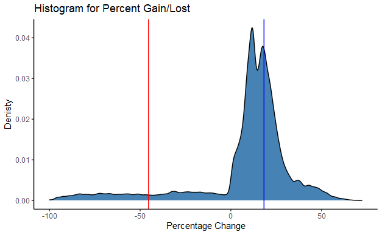

# General

### Data Requirements

The data you use in the project has to meet the following criteria:

- At least 5,000 rows
- At least 3 sources of data
- Must contain text data, numeric data and dates

Most of the data supplied with the briefs do meet the requirements, but we recommend that you personally make sure that you are indeed meeting these criteria. If your current datasets do not, you are more than welcome to supplement your analysis with further datasets that would help you meet the requirements.

### Product Requirements

Your actual final project analysis process will remain largely the same regardless if you are completing the PDA or not. However, you will need to do a bit more formal planning/documentation of your project for the PDA.

Please create a project plan/documentation according to the template below:

# Template

 

::: {.emphasis}
Use this template with associated subheadings to create the documentation to make sure you cover all necessary learning outcomes for the PDA. If you have any questions, just let an instructor know.
:::

## **Context**

 

#### **Business intelligence and data-driven decision making**

__What insights can the business/organisation gain from your analysis and how will your analysis help the business/organisation make better decisions?__

* Using descriptive analytics, I was able to look at the data provided to find correlations between certain demographics and the likelihood that these demographics will default on a loan. 
* The descriptive analytics help Lending Club inform the grading and therefore the interest rate assigned to an individuals loan, by assigning the risk of default.

* Using predictive analytics, I was able to build several machine learning models to predict who will default in the future. Using the best machine model allows Lending Club to predict if someone will default on a loan, or not. Using the best model allows Lending Club to inform investors of different risks categories associated with the various grades of loan, allowing for a better understanding between the investors and Lending Club, which instills trust in the investors about the loans they are buying.

 

#### **Domain knowledge and the business context**

__Briefly describe the business/organisation and where your analysis fits within its aims/activity.__ 

* Lending Club is a peer-to-peer marketplace for small unsecured loans, connecting investors with borrowers directly. 

* Lending Club approves loans that they anticipate will be paid in full with interest back to the investors, while minimizing defaults. Knowing many variables about a potential new customer allows Lending Club to categorize the borrowers based on the application form, credit history and financial market conditions.

* Lending Club aims to make as much commission as possible from issuing these loans, however, it is important that a level of trust is maintained particularly to the investors. 

* My analysis helps Lending Club look backwards and forwards at any individual borrower and assess their risk of default. It is very important that this is done accurately as investors trust the grades of loans they are being sold to only have a certain default rate, for the investors to make returns.

 

## **Data**

 

#### __Internal and external data sources__

Briefly describe your data sources and which were internal (provided by the organisation) and external (not sourced from the organisation's data)

__Internal data sources:__

* Lending Club Loans Data - the main data set.
* Lending Club Dictionary - Data Dictionary informing the variables
* State Names Info - Full state name with the key in the main data set
* Grade Info - Overall grade (A-G) with the key in the main data set

 

#### **Types of data**

__What kind of data did you work with? E.g. categorical and numerical data and their sub-types.__

* The data contained text data, numeric data and dates.
* I chose to exclude analysis of the date data as I anticipated this would be skewed by the 08' finacial crisis, as the data is given from 2007 - 2011.
* For analysis, I converted continuous numeric variables to integers and then grouped the integers in specific ranges to get proportions to fit onto histogram plots.
* In the machine learning section, character variables were either mutated to binary variables or made into dummy variables (TRUE/FALSE).

 

#### **Data formats**

__What format did your data come in? E.g. all downloaded flat files (CSV) or any data from APIs, scraping etc.__

* The data format was 3 csv files
* All the data was then joined to make one csv file, which I used in analysis.

 

#### **Data quality and bias**

__Briefly describe the quality of the data and whether you have any reasons to suggest the data is biased e.g. only data from a specific demographic even though a broader demographic would be of interest to the organisation.__

* The data is given from 2007 - 2011, which overlaps with the great financial crisis of 2008, so there may be a bias in the default rates for this given period.

* The data only shows approved applications for individuals, so my analysis and machine learning models can only be applied to individuals - unless a new data set is supplied. Further analysis would be required if partners data was available.

* As ~ 85% of loans are fully paid and only ~ 15% are defaulted on, this innate data bias makes building the model very difficult. No investor will take on a loan where a default rate is greater than 50% as the average losses in defaulted loans are ~ 50%. See graph below

* Aside from that, the data quality is very good and provides a lot of insight into the loans made.

 

## **Ethics**

 

#### **Ethical issues in data sourcing and extraction**

__Do you have any ethical concerns regarding the sourcing and extraction of your data?__ 

* The data is sourced and extracted at the borrowers permission in the application stage of the loan. 

* There is variable I found questionable, "credit inquiries < 6 months". This variable is pulled on the applicant to see if they have inquired about lines of credit in the past 6 months. I think this is ethically questionable, as if you are denied access to credit, it goes on your credit record and makes it much more difficult to get a loan in the near future.

 

#### **Ethical implications of business requirements**

__Are there any ethical implications of the business requirements?__

* In terms of Machine Learning, there may be ethical considerations when using such a model to determine who does and does not get a loan. It is important the model is not discriminating explicitly on any variables outside the applicants control, however, no such variables are supplied. 

 

## Analysis

 

#### **Stages in the data analysis process**

__What were the main stages in your data analysis process?__

1. Understanding the Data using the data dictionary
2. Initial Data Exploration of the variables
3. Data Cleaning, culminating with a data cleaning script
4. Data Exploration and Analysis, looking at which variables inform loan_status. Using simple statistics proportions, percentages and averages to better explain these.
5. Planning the Machine Learning Model Process.
6. Building Machine Learning Models using Logistic Regression and Random Forests.

 

#### **Tools for data analysis**

__What were the main tools you used for your analysis?__

* R and RStudio
* Python

 

#### **Descriptive, diagnostic, predictive and prescriptive analysis**

__Please report under which of the below categories your analysis falls **and why** (can be more than one)__ 

::: {.emphasis}

**Descriptive Analytics** tells you what happened in the past.

* I was able to retroactively look backwards at the loans that had come to maturity and explore which variables informed the loan status. 

**Predictive Analytics** predicts what is most likely to happen in the future.

* Using machine learning models, I was able to look forward to try and predict who is going to default on their loan or not, based on the information supplied by the applicant and the credit report. 

:::

 

# PDA Outcomes

### Working with Data (J4Y6 35)

#### 1. Plan an analysis to provide business intelligence

-   1.1 Business intelligence and data-driven decision making
-   1.2 Domain knowledge and the business context
-   1.4 Internal and external data sources
-   1.5 Data quality
-   1.6 Stages in the data analysis process
-   1.7 Descriptive, diagnostic, predictive and prescriptive analysis
-   1.9 Ethical implications of business requirements
-   1.10 Tools for data analysis

#### 2. Extract data from a variety of sources

-   2.1 Tools for querying data sources
-   2.2 Types of data (categorical and numerical data and their sub-types)
-   2.3 Data formats
-   2.6 Data quality including data bias
-   2.7 Ethical issues in data sourcing and extraction

#### 4. Analyse data to provide business intelligence

-   4.7 Role of domain knowledge in interpreting analyses
